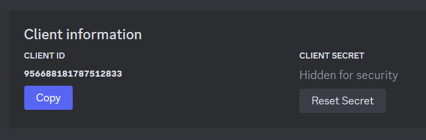

# NoNICK.js Dashboard

> [!WARNING]
> このプロジェクトは現在開発中であり、本番環境で動作させる準備が整っていません。

[Remix](https://remix.run)で構築された、[NoNICK.js](https://github.com/nonick-js/bot)のWebダッシュボード

## 🚧Progress
- [x] Discord OAuth2を使用したセッション管理
- [ ] `favicon.ico`、`robots.txt`の作成
- [ ] 各ページの作成
  - [ ] `/` ... サーバー選択ページ
    - [x] ... ページの作成
    - [x] ... サーバーサイドの処理
    - [x] ... レスポンシブ対応
    - [ ] ... エラーハンドリング
  - [ ] `/guilds/$id` ... Bot設定ページ
    - [ ] ... ページの作成
    - [ ] ... サーバーサイドの処理
    - [ ] ... サイドバーの作成
    - [ ] ... フォーム用コンポーネントの作成
    - [ ] ... レスポンシブ対応
    - [ ] ... エラーハンドリング

## 📑Usage
### Discordアプリケーションを作成する
まず、[Discord開発者ポータル](https://discord.com/developers/applications)でWebダッシュボードに使うDiscordアプリケーションを作成する必要があります。アプリケーションを作成したら、「OAuth2」タブにアクセスし、`Redirects`に以下のURLを追加してください。

* `http://localhost:5173/auth/callback`
* `http://localhost:5173/invite/callback`

### 環境変数を設定する
ルートディレクトリに`.env`ファイルを作成し、環境変数を設定します。

|変数名|説明|
|---|---|
|`BASE_URL`|ダッシュボードのベースURL|
|`DATABASE_URL`|MongoDBの接続に使用するURL|
|`DATABASE_NAME`|MongoDBのコレクション名|
|`SESSION_SECRET`|セッションに使用するシークレットキー|
|`DISCORD_ID`|Discord OAuth2に使用するクライアントID|
|`DISCORD_SECRET`|Discord Oauth2に使用するクライアントシークレット|
|`DISCORD_PERMISSION`|DiscordBotの招待リンクに追加する権限|

`openssl`が使用できる場合、以下のコマンドで`SESSION_SECRET`の値を作成できます。
```sh
openssl rand -base64 32
```

`DISCORD_ID`と`DISCORD_SECRET`は、[Discord開発者ポータル](https://discord.com/developers/applications)でアプリを選択し、「OAuth2」タブにアクセスすることで取得できます。



設定が終わったら、以下のコマンドを使用して開発サーバーを起動します。

```sh
pnpm dev
```
